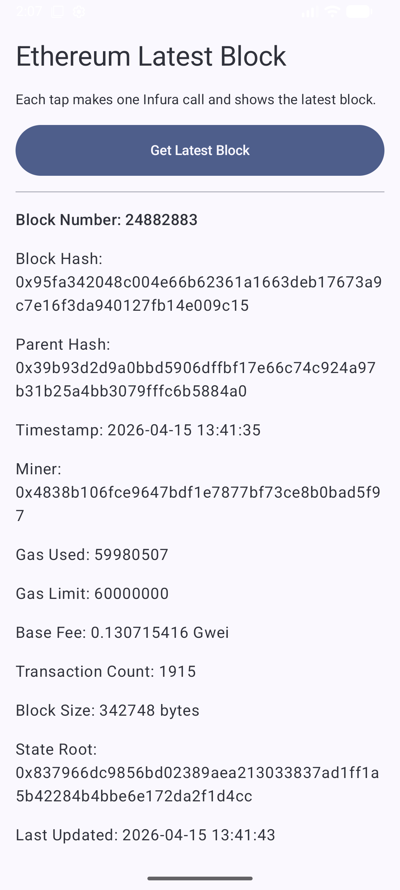

# Component App - Get Latest Ethereum Block Data and Display

<p align="center">
    
</p>

### To build

1. Run this command to create the local properties file. Replace the infura key with your own and you can change the Ethereum network to `mainnet`, `sepolia` or `hoodi`.
- MacOS and Linux
```bash
cp extra/local.properties.example local.properties
```
- Windows
```bash
copy extra/local.properties.example local.properties
```

2. Build the app with:
- MacOS and Linux
```bash
./gradlew buildAPK
```
- Windows
```bash
gradlew.bat buildAPK
```

3. The app has been built and placed in `build-dev`. You can transfer it to your android device and install it by running the `.apk` file.

